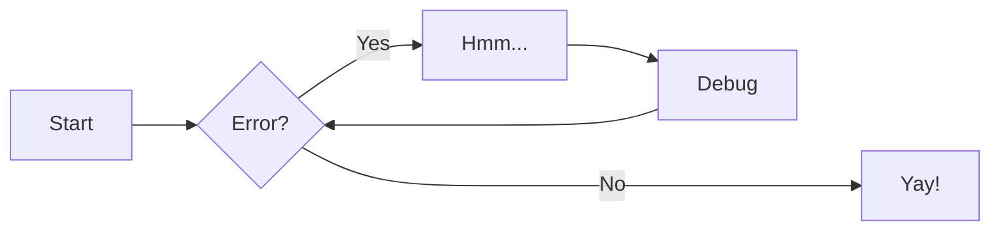

# Example Documentation

Just a quick example of additional Markdown extensions and features available in the documentation.

Find all the detailed documentation [here](https://squidfunk.github.io/mkdocs-material/reference/).

### Admontions (Notes, Warnings, etc..)

```md
!!! note

    Lorem ipsum dolor sit amet, consectetur adipiscing elit. Nulla et euismod
    nulla. Curabitur feugiat, tortor non consequat finibus, justo purus auctor
    massa, nec semper lorem quam in massa.
```

!!! note

    Lorem ipsum dolor sit amet, consectetur adipiscing elit. Nulla et euismod
    nulla. Curabitur feugiat, tortor non consequat finibus, justo purus auctor
    massa, nec semper lorem quam in massa.

```md
!!! warning

    Lorem ipsum dolor sit amet, consectetur adipiscing elit. Nulla et euismod
    nulla. Curabitur feugiat, tortor non consequat finibus, justo purus auctor
    massa, nec semper lorem quam in massa.
```

!!! warning

    Lorem ipsum dolor sit amet, consectetur adipiscing elit. Nulla et euismod
    nulla. Curabitur feugiat, tortor non consequat finibus, justo purus auctor
    massa, nec semper lorem quam in massa.

### Arithmetex

```md
$$
E(\mathbf{v}, \mathbf{h}) = -\sum_{i,j}w_{ij}v_i h_j - \sum_i b_i v_i - \sum_j c_j h_j
$$
```

$$
E(\mathbf{v}, \mathbf{h}) = -\sum_{i,j}w_{ij}v_i h_j - \sum_i b_i v_i - \sum_j c_j h_j
$$

### Caret

```md
^^asdfasfd^^
```

^^asdfasfd^^

### Emoji

```md
:smile:
```

:smile:

### Inline Code Highlighting

```md
Here is some code: `#!py3 import pymdownx; pymdownx.__version__`.
```

Here is some code: `#!py3 import pymdownx; pymdownx.__version__`.

### Keys

```md
++ctrl+alt+delete++
```

++ctrl+alt+delete++

### Tilde

```md
~~sadfasdf~~
```

~~sadfasdf~~

### Flow Charts

```md
    ```mermaid
    graph LR
    A[Start] --> B{Error?};
    B -->|Yes| C[Hmm...];
    C --> D[Debug];
    D --> B;
    B ---->|No| E[Yay!];
    ```
```



### (Github) Magic Links

```md
This is #1 and !45
```

This is #1 and !45

### Mark

```md
==mark me==

==smart==mark==
```

==mark me==

==smart==mark==


### Symbols

```md
(tm), (c)
```

(tm), (c)

### Syntax Highlighting and Copy button


```python
import this
```

```
import this
```


### Tabbed Code blocks

```md
=== "Not Me"
    Markdown **content**.

    Multiple paragraphs.

===+ "Select Me"
    More Markdown **content**.

    - list item a
    - list item b

=== "Not Me Either"
    Another Tab
```

=== "Not Me"
    Markdown **content**.

    Multiple paragraphs.

===+ "Select Me"
    More Markdown **content**.

    - list item a
    - list item b

=== "Not Me Either"
    Another Tab

### Task lists

```md
- [x] Lorem ipsum dolor sit amet, consectetur adipiscing elit
- [ ] Vestibulum convallis sit amet nisi a tincidunt
```

- [x] Lorem ipsum dolor sit amet, consectetur adipiscing elit
- [ ] Vestibulum convallis sit amet nisi a tincidunt
    * [x] In hac habitasse platea dictumst
    * [x] In scelerisque nibh non dolor mollis congue sed et metus
    * [ ] Praesent sed risus massa
- [ ] Aenean pretium efficitur erat, donec pharetra, ligula non scelerisque
