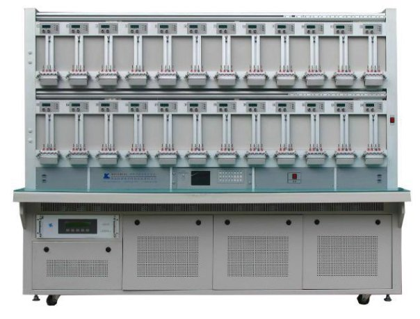

# ACCURACY TEST AND COMPLIANCE REPORT

**Abstract:** This document summarizes the technical specification, accuracy tests and comparison with regulatory standards.

## Overview

The purpose of this document is to showcase the accuracy of the AC meter developed under this EnAccess opensource project. This will be primarily achieved by comparing the meter accuracy with international best practices by IEC standards, NEMSA metering guidelines and Nigerian smart meter regulation.

## Meter datasheet

|S. NO.|DESCRIPTION|UNITS|AS FURNISHED BY BIDDER|
| :- | - | - | :- |
|1|Type of meter||Single phase two wire|
|2|Accuracy Class of the meter||Class 1|
|3|Ib & Imax|A|5(80)|
|4|Operating Voltage|V|230|
|5|Operating Frequency|Hz|50|
|6|Power Consumption|W|2|
|7|Starting Current|mA|50|
|8|Short time over current|A|1000|
|9|Rated impulse withstand voltage|KV|1\.5 (CAT II)|
|10|Resistance to heat and fire (As per specification||Fire retardant material was used in manufacturing the exterior casing|
|11|Degree of protection||IP50|
|12|Accuracy requirements (As per IEC 62053-21/22||Class 1|
|13|Power factor range||Zero lag to Zero.|
|14|Energy measurement||
Fundamental

energy +Energy due to Harmonics
|
|15|Connection Diagram for system on terminal cover|Yes/No|Yes|
|16|Self-diagnostic feature||(i) Time and calendar.
(ii) Real Time Clock.

(iii) RTC battery. Non-Volatile Memory.
|
|17|Initial start-up of meter (meter shall be fully functional within 5 sec after reference voltage is applied to the meter terminals)||Yes|
|18|Terminal block a) Depth of the Terminal holes. b) Internal diameter of terminal holes c) Clearance between adjacent terminals
|mm|a) 9.5 (minimum). b) 25 c) 3
|
|19|Communication capabilities as per clause 4.31||RS485|
|20|Immunity against HV ESD as defined in Cl. 4.32.2||(CBM) charged body model 2000V|
|21|DC Immunity as defined in Cl. 4.33|||
|22|
Grade of material for

a) Meter base.

b) Meter cove.

c) Terminal block.

d) Terminal cover
||Epoxy|
|23|Tamper counts||yes|
|24|
Recording forward energy in all conditions as per annexure I

(Including

current/potential reversal)
|Yes/No|yes|
|25|Makes of all components used in the meter.|Yes/No||
|26|Non-Volatile memory (Retention period)||100 years|
|27|Measuring elements used in the meter||AFE chip|
|28|Power supply to circuit in case of supply failure||Battery|
|29|Display of measured values (As per specification –clause 5.8)|Yes/No|Yes|
|30|LCD display (Type and viewing angle)||16x2 LCD display|
|31|Pulse rate|Imp/kWh,Imp/kVArh|1000|
|32|Name plate marking|Yes/No|Yes|
|33|Routine test certificates|Yes/No|No|
|34|Acceptance test certificates|Yes/No|No|
|35|Type test certificates|Yes/No|No|
|36|Guarantee certificates|Yes/No|No|

## Accuracy test

Three sample prototype meters were manufactured in as required by the Nigerian Electricity Management Services Agency (NEMSA). These meters will be sent to NEMSA for an official type test and report will be provided accordingly.

Tested meters: MT100, MT50 and MT25

|**MT100**|**MT50**|**MT25**|
| - | - | - |
||||

### Accuracy test: MT100

|**Test point (%)**|**Voltage supplied (V)**|**Actual voltage (V)**|**Current supplied (A)**|**Actual current (A)**|**Expected power (W)**|**Actual power (W)**|**Error (%)**|
| :- | :- | - | - | :- | :- | :- | - |
|**Imax 1.0**|239\.869|240|79\.9683|79\.96|19085\.1|19190\.4|-0.2752|
|**Imax 0.5L**|240\.002|240|80\.0044|80|9522\.3|9600|0\.191|
|**1200 (1.0)**|240\.012|240|59\.9996|59\.99|14237\.1|14397\.6|0\.442|
|**1200**|240\.116|240|60\.0088|60\.02|7156\.7|7202\.4|0\.0364|
|**(0.5L)**|240\.018|240|30\.0005|30\.01|7194\.11|7202\.4|0\.1744|
|**(600 (0.5L)**|240\.015|240|30\.0007|29\.98|3598\.5|3597\.6|0\.0154|
|**(100 (1.0)**|240\.015|240|5\.0063|5|1199\.91|1200|-0.0602|
|**100 (0.5L)**|240\.141|240|5\.0033|5|602\.67|600|-0.0475|
|**5 (1.0)**|0|0|0|0|0|0|0|
|**5 (0.5L)**|0|0|0|0|0|0|0|

Table 1: Accuracy Test Result of Meter MT100

### Accuracy test: MT50

|**Test point (%)**|**Voltage supplied (V)**|**Actual voltage (V)**|**Current supplied (A)**|**Actual current (A)**|**Expected power (W)**|**Actual power (W)**|**Error (%)**|
| :- | :- | - | - | :- | :- | :- | - |
|**Imax 1.0**|240\.008|240|79\.995|79\.74|19111\.03|19137\.6|0\.4149|
|**Imax 0.5L**|240\.19|240|80\.2|79\.94|9633\.12|9592\.8|-0.4011|
|**1200 (1.0)**|240\.003|240|60\.0051|59\.91|14362\.01|14378\.4|0\.0199|
|**1200**|239\.99|240|59\.9019|59\.84|7307\.49|7180\.8|0\.2463|
|**(0.5L)**|240\.001|240|30\.00014|29\.97|7167\.161|7192\.8|0\.038|
|**(600 (0.5L)**|240\.19|240|30\.00016|29\.27|3601 5|3512\.4|0\.824|
|**(100 (1.0)**|239\.998|240|5\.00011|4\.97|1190\.211|1192\.8|-0.0874|
|**100 (0.5L)**|240\.027|240|5\.00001|5\.01|602\.7|601\.2|0\.0351|
|**5 (1.0)**|0|0|0|0|0|0|0|
|**5 (0.5L)**|0|0|0|0|0|0|0|

Table 2: Accuracy Test Result of Meter MT50

### Accuracy test: MT25

|**Test point (%)**|**Voltage supplied (V)**|**Actual voltage (V)**|**Current supplied (A)**|**Actual current (A)**|**Expected power (W)**|**Actual power (W)**|**Error (%)**|
| :- | :- | - | - | :- | :- | :- | - |
|**Imax 1.0**|240\.062|240\.8|80\.0008|79\.61|19151\.99|19170\.09|-0.5233|
|**Imax 0.5L**|240\.135|240\.8|80\.0002|79\.66|9621\.6|9591\.064|-0.3491|
|**1200 (1.0)**|240\.003|240\.9|60\.0075|59\.73|14382\.55|14388 96|-0.1144|
|**1200**|239\.863|240\.9|59\.9754|59\.73|7111\.8|7194\.479|0\.5069|
|**(0.5L)**|239\.993|240\.9|30|29\.85|7192\.41|7190\.865|0\.0542|
|**(600 (0.5L)**|239\.999|241|29\.9999|29\.82|3612\.74|3593\.31|0\.3466|
|**(100 (1.0)**|240\.032|241|5\.0064|4\.99|1196\.21|1202\.59|0\.2996|
|**100 (0.5L)**|240\.039|241\.1|5\.00036|4\.96|613\.66|597\.928|-0.0689|
|**5 (1.0)**|0|0|0|0|0|0|0|
|**5 (0.5L)**|0|0|0|0|0|0|0|

Table 3: Accuracy Test Result of Meter MT50

## IEC (International Electrotechnical Commission) metering specification

### Short overview of IEC

The International Electrotechnical Commission (IEC) is a worldwide organization for standardization comprising all national electrotechnical committees (IEC National Committees). The objective of IEC is to promote international co-operation on all questions concerning standardization in the electrical and electronic fields. To this end and in addition to other activities, IEC publishes International Standards, Technical Specifications, Technical Reports, Publicly Available Specifications (PAS) and Guides (hereafter referred to as “IEC Publication(s)”). Their preparation is entrusted to technical committees; any IEC National Committee interested in the subject dealt with may participate in this preparatory work. International, governmental and non- governmental organizations liaising with the IEC also participate in this preparation. IEC collaborates closely with the International Organization for Standardization (ISO) in accordance with conditions determined by agreement between the two organizations. (webstore.iec.ch, n.d.). The IEC addresses safety aspects by establishing basic group and product safety publications. A *basic safety publication* covers a specific safety-related matter, applicable to many electrotechnical products. It is primarily intended for use by technical committees in the preparation of standards in accordance with the principles laid down in IEC Guide 104 and ISO/IEC Guide 51. It is not intended for use by manufacturers or certification bodies. One of the responsibilities of a technical committee is, wherever applicable, to make use of basic safety publications in the preparation of its publications. The requirements, test methods or test conditions of basic safety publications will not apply unless specifically referred to or included in the relevant publications. The IEC standard codes highlighted below are the plumbline for a design engineer as related to meter design. (webstore.iec.ch, n.d.).

1. **IEC 62052-11. (webstore.iec.ch, n.d.).**
2. **IEC 62053-22. (webstore.iec.ch, n.d.).**

### **IEC 62053-11 (Publication date:** 2020-06-17) **:**

IEC 62052-11: 2020 specifies requirements and associated tests, with their appropriate conditions for type testing of AC and DC electricity meters. This document details functional, mechanical, electrical and marking requirements, test methods, and test conditions, including immunity to external influences covering electromagnetic and climatic environments.

This document applies to electricity metering equipment designed to:

- Measure and control electrical energy on electrical networks (mains) with voltage up to 1000VAC, or 1500 VDC.
- Have all functional elements, including add-on modules, enclosed in, or forming a single meter case with exception of indicating displays.
- Operate with integrated displays (electromechanical or static meters);
- Operate with detached indicating displays, or without an indicating display (static meters only).
- Be installed in a specified matching socket or racks;
- Optionally, provide additional functions other than those for measurement of electrical energy.

Meters designed for operation with Low Power Instrument Transformers (LPITs as defined in the IEC 61869 series) may be tested for compliance with this document and the relevant IEC 62053 series documents only if such meters and their LPITs are tested together as directly connected meters. This document is also applicable to auxiliary input and output circuits, operation indicators, and test outputs of equipment for electrical energy measurement. This document also covers the common aspects of accuracy testing such as reference conditions, repeatability and measurement of uncertainty.

This document does not apply to:

- Meters for which the voltage line-to-neutral derived from nominal voltages exceeds 1 000 V AC, or 1 500 V DC;
- Meters intended for connection with low power instrument transformers (LPITs as defined in the IEC 61869 series of standards) when tested without such transformers;
- Metering systems comprising multiple devices (except of LPITs) physically remote from one another;
- Portable meters;
- Meters used in rolling stock, vehicles, ships and airplanes
- Laboratory and meter test equipment;
- Reference standard meters;
- Data interfaces to the register of the meter;
- Matching sockets or racks used for installation of electricity metering equipment;
- Any additional functions provided in electrical energy meters.

This document does not cover measures for the detection and prevention of fraudulent attempts to compromise a meter’s performance (tampering).

This second edition cancels and replaces the first edition published in 2003, and its amendment 1:2016. This edition constitutes a technical revision.

This edition includes the following significant technical changes with respect to the previous edition:

1. Removed all meter safety requirements; the meter safety requirements are covered in IEC 62052-31:2015;
2. Included requirements for meter power consumption and voltage requirements from IEC 62053-61; IEC 62053-61 is withdrawn;
3. Included requirements for meter symbols from IEC 62053-52; IEC 62053-52 is withdrawn;
4. Included requirements for meter pulse output devices from IEC 62053-31; IEC 62053-31 is withdrawn;
5. Added new requirements and tests including: meters with detached indicating displays, and meters without indicating displays, meter sealing provisions; measurement uncertainty and repeatability; time-keeping accuracy; type test report
6. Updated and clarified acceptance criteria for testing of external influences;
7. Revised and updated tests for immunity to electromagnetic influences and disturbances as per the latest editions of the basic EMC publications. (webstore.iec.ch, n.d.).

### **IEC 62053-22 ( Publication date :** 2020-06-17 ) **:**

Applies only to transformer operated static watt-hour meters of accuracy classes 0,1 S, 0,2 S and 0,5 S for the measurement of alternating current electrical active energy in 50 Hz or 60 Hz networks and it applies to their type tests only.

This document applies to electricity metering equipment designed to:

- Measure and control electrical energy on electrical networks (mains) with voltage up to 1 000 V AC;
- Have all functional elements, including add-on modules, enclosed in, or forming a single meter case with exception of indicating displays;
- Operate with integrated or detached indicating displays, or without an indicating display;
- Be installed in a specified matching socket or rack;
- Optionally, provide additional functions other than those for measurement of electrical energy.

This document does not apply to:

- meters for which the voltage line-to-neutral derived from nominal voltages exceeds 1 000 V AC;
- Meters intended for connection with low power instrument transformers (LPITs as defined in the IEC 61869 series) when tested without such transformers;
- Metering systems comprising multiple devices physically remote from one another.
- Portable meters;
- Meters used in rolling stock, vehicles, ships and airplanes;
- Laboratory and meter test equipment;
- Reference standard meters;
- Data interfaces to the register of the meter;
- Matching sockets or racks used for installation of electricity metering equipment
- Any additional functions provided in electrical energy meters.

This document does not cover measures for the detection and prevention of fraudulent attempts to compromise a meter’s performance (tampering)

This second edition cancels and replaces the first edition published in 2003 and its amendment 1: 2016. This edition constitutes a technical revision.

This edition includes the following significant technical changes with respect to the previous edition:

1. Removed all meter safety requirements; the meter safety requirements are covered in IEC 62052-31: 2015.
2. Moved the descriptions of all general requirements and test methods from IEC 62053-21: 2003, IEC 62053-22: 2003, IEC 62053-23: 2003, IEC 62053-24: 2003 to IEC 62052-11:2020; IEC 62053-21:2020, IEC 62053-22:2020, IEC 62053-23:2020, IEC 62053-24:2020 contain only accuracy class specific requirements.
3. Added new requirements and tests concerning:
    1. active energy meters of accuracy class 0,1S;
    2. measurement uncertainty and repeatability (7.3, 7.8);
    3. influence of fast load current variations (9.4.12);
    4. immunity to conducted differential current disturbances in the 2 kHz to 150 kHz frequency range (9.3.8). (webstore.iec.ch, n.d.).

## Design justification according to the stated iec metering standard

### Electrical design justification

According to the IEC design specification and standard highlighted above, **First Electric** has been able to achieve and meet the standards in Hardware design as related to CATII for high voltage handling capability, invariably the AFE (Analog Front End) chip used (ATM90e26) to measure all metering parameter have a high accuracy fitting for a class 0.1 meter, maximum measurement error of ±0.5%, Human Body Model (HBM) of 2000V according to JESD22-A114 test condition, Charged Device Model (CDM) of 500V according to JESD22-C101 test condition. We carried out meter accuracy-test according to the IEC metering specification standard using a reference meter test-bench, we were able to achieve an accuracy level of **±0.5%,** as highlighted in the percentage error row of the type test results in table 1,2 and 3. The accuracy test was done across different voltage, current and power factor range, with the result of three piece of meter highlighted above.

### Mechanical design justification

Haven gone through the IEC specification as related to metering exterior casing and mechanical related design, the following was highlighted as designed in the meter.

1. IP rating.
1. Exterior casing material flammability.

**IP Rating:**

The IP rating as specified in IEC metering standard is IP51, First Electric successfully designed and manufactured and IP51 exterior casing from JLCPCB.

**Exterior casing material flammability:**

According to IEC 62052-21/22, designed energy meter should have a high tolerance to fire, meaning the exterior casing, terminal block/connector shall not fuel the increase in fire in situations where there is fire outbreak or any relating event.

First Electric designed the exterior casing to be used alongside a terminal block bought in the market which ensure proper insulation as related to the relevant IEC standard.

## Comparison with nigerian metering code

[Nigeria Metering Code Version 02](https://www.abujaelectricity.com/wp-content/uploads/2016/04/MeteringCode_V02_03112014.pdf)

### General

The technical specifications enunciated herein are a summary of minimum requirements for energy meters and metering accessories approved for use in Nigeria’s electricity network. It is aimed at promoting quality of energy metering in Nigeria to ensure fair play in energy transactions among utilities and customers and safety of all meter users. Among different meter specification highlighted in the Nigeria metering code version2, First Electric highlighted the below as relevant to the meter type constructed.

The specifications cover the following as extracted from Nigeria metering code version 2:

1. Electronic Meters.
1. Prepaid Meters.
1. Smart Metering.

This Code recognizes all the existing meter technologies however the framework for future deployment of meters shall be smart metering.

The specifications are prepared in accordance with the following International Standards:

1. IEC 62052-11.
1. IEC 62053-11,21,22 and 23.
1. IEC 62055-41 and 52.
1. IEC 62056.
1. IEC 60044-1,2 and 3.

### Technical specifications for static/electronic meters. General construction and component specifications for static energy meters

==**METERING CODE REF: 4.4.1**==

|**SN**|**PARAMETERS**|**TECHNICAL REQUIREMENTS**|**COMMENT**|
| - | - | - | - |
|1|Body of Meter|Bakelite or Polycarbonate|Not applicable for prototype|
|2|Terminal Block|Made of polycarbonate grade and shall form integral part of the Meter base, brass or copper current terminals with star head brass screws as well as bimetallic contacts.|Comply|
|3|Terminal cover|Transparent terminal cover with external provision of sealing through sealing screws.|Not applicable for prototype|
|4|Diagram of connections|Diagram of external connections to be shown inside the terminal cover.|Comply|
|5|Marking on name plates|Meter shall have clearly visible, indelible and distinct name plate.|Comply|
|6|Meter Sealing|One seal shall be affixed on one side of Meter body|Not applicable for prototype|
|7|Guarantee/Warranty|5 years|Comply|
|8|Resistance to heat and fire|The terminal block of Meter case shall be protected against the spread of fire. They shall not be ignited by thermal overload of live parts in contact with them.|Comply|

### Other general component specifications

==**METERING CODE REF: 4.4.2.**==

|**SN**|**COMPONENT FUNCTION**|**TECHNICAL REQUIREMENTS**|**COMMENT**|
| - | :- | - | - |
|1|Measurement or computing chips|The Measurement or computing chips used in the Meter shall be with the Surface mount type along with the ASCIIs.|Comply|
|2|Memory Chips|The memory chips shall not be affected by the external parameters like sparking, high voltage spikes or electrostatic discharges.|Comply|
|3|Display Modules|
a) The display modules shall be well protected from the external Ultra-Violet (UV) radiations.

b) The display visibility shall be sufficient to read the Meter mounted at a height of

0\.5 meter as well as at the height of 2 meters.
|Comply|
|4|Communication Modules|Communication modules shall be compatible for the two RS 232/485 ports one for optical port for communication with Meter reading instruments & the other, for the hardware. RS 232/485 port to communicate with various modems for AMR such as mobile telephony, radio frequency, fixed line, satellite, or power line communication technology with IEC 62056-21 DLMS/COSEM protocol.|Not comply (only RS232 provided)|
|5|Optical Port|Optical port shall be used to transfer the Meter data to Meter reading instrument. The mechanical construction of the port shall be such to facilitate the data transfer easily.|Not comply|
|6|Power Supply|The power supply shall be with the capabilities as per the relevant standards. The power supply unit of the Meter shall not be affected in case the maximum voltage of the system appears to the terminals due to faults or due to wrong connections.|Comply|
|7|Electronic Components|The active and passive components shall be of the surface mount type to be handled and soldered by the state-of-the-art assembly processes. The components shall be positioned in such a way that the leads of components shall not be under stress and not touching the internal wires.|Not applicable for prototype|
|8|Mechanical Parts|
The internal electrical components shall be of electrolytic copper and shall be protected from corrosion, rust, etc.

The other mechanical components shall be protected from rust, corrosion, etc.by suitable plating and painting methods.
|Comply|
|9|Battery|Lithium with minimum guaranteed life of 10 years and can last without recharging for 60 days|Comply|
|10|RTC & Micro Controller|The accuracy of Real Time Clock shall be as per relevant IEC standards|Comply|
|11|P.C.B|Glass Epoxy, fire resistance grade FR4, with minimum thickness of 1.6mm|Comply|

### General requirements

==**METERING CODE REF: 4.4.4.**==

|**SN**|**PARAMETER**|**TECHNICAL REQUIREMENTS**|**COMMENT**|
| - | - | - | - |
|1|On the Meter name-plate:|a) Indelible Meter serial number shall not be more than twelve (12) digits and legibly printed. b) Size of the digit of the Meter serialnumber shall be a minimum of 5mm x 3mm. c) Bar code shall be printed below the Meter serial number d) Manufacturer’s Name and Trade mark. e) Place of manufacture. f) Year of manufacture. g) Reference Voltage, Current and Frequency. h) Class index. i) Meter Constant. j) Owner/Utility’sIdentity.
|a) Comply b) Comply c) Not applicable for prototype d) Comply e) Comply f) Comply g) Comply h) Comply i) Comply j) Comply
|
|||The manufacturer shall affix one seal on one side of the Meter|Not applicable for prototype|
|||The internal potential links shall be in closed position or link- less. Meters will be preferred and there shall not be any external link.|Not applicable for prototype|
|||Terminal cover shall be fixed on Meter before dispatch|Comply|
|||The operation manual and the inscriptions on the name plate shall be provided in English Language.|Comply|

### Single phase (2wire) 5(60) AMPs credit static mete

==**METERING CODE REF : 4.4.5**==

|**SN**|**PARAMETERS**|**TECHNICAL REQUIREMENTS**|**COMMENT**|
| - | - | - | - |
|1|Standards|IEC 62052-11,62053-21|Comply|
|2|Accuracy Class|1\.0|Comply|
|3|Frequency|50Hz ± 2%|Comply|
|4|Operating Temp.|Up to 600C|Comply|
|5|Storage Temp.|Up to 700C|Comply|
|6|Relative Humidity|96% at 450C non-condensing|Comply|
|7|Life Span|Minimum of 10 years|Comply|
|8|Impulse withstand voltage|Not less than 6KV|Not tested|
|9|Reference Voltage|240 volts (P-N), -40% to +10% Vref, however the Meter shall withstand the maximum system voltage i.e. 415 Volts continuously|Comply|
|10|Display|
k) LCD( Six digits)

l) Height:9mm x 4.5mm minimum m) Viewing angle160 degrees minimum
|Comply|
|11|Power factor range|Zero lag – unity – zero lead|Comply|
|12|Display parameters|
Display Parameters: LCD test, KWH, Date

& Time (Cumulative KWH will be indicated continuously by default and other parameters through push-button)

Display order shall be as shown on S/N 24 below.
|Comply|
|13|Burden|Less than 2VA in voltage circuit and 1VA for current circuit|Not applicable, CT used.|
|14|Starting current|0\.4% of Ib.|Not comply(1% of Ib)|
|15|Test Output Device|Flashing LED visible from the front|Comply|
|16|Billing data|Meter serial number, Date and time, KWh and history for last 6 months. All these data shall be accessible for reading, recording and spot billing by downloading through IR port on universal CMRI or Laptop computers at site.|Not comply|
|17|Terminal Configuration|Ph-N, N-Ph(Symmetrical)|Comply|
|18|Security feature|Programmable facility to restrict the access to the information recorded at different security levels such as read communication, communication write etc|Comply|
|19|Memory|Non-volatile memory independent of battery backup. Information stored in the memory shall be retained for a minimum of 10 years in case of power failure.|Comply|
|20|Software & communication compatibility|
IR port to transfer locally through Common Meter Reading Instrument (CMRI) or laptop.

The service provider shall supply Software required for CMRI. He shall also provide training for the use of software. The software shall be compatible to Microsoft Windows systems latest version.

The Service Provider shall provide Meter-reading protocols and jointly work with the Utility to develop CMRI software for downloading and further uploading on computer. The service provider has to give an undertaking in this regard.
|Not comply|
|21|Terminal hole Diameter|Shall be 9mm.|Comply|
|22|
TAMPER EVENTS

Phase & neutral interchanged

I/C disconnected, Neutral & connected to earth neutral O/G load

I/C neutral disconnected, O/G neutral connected to earth through a resistor.

I/C phase & neutral interchanged, load connected to earth
|
METER BEHAVIOUR

Meter shall record forward energy
|Comply|
|23|
Influence parameters|The Meter shall work satisfactorily with guaranteed accuracy limit under the presence of following influence quantities as per IEC 61036.

- External magnetic fields. - Electromagnetic field induction. - Radio frequency interference. - Vibration etc. - Waveform 10% of 3rd harmonics. - Electromagnetic High Frequency - (H.F.)Fields. -DC Immunity test.
|Not tested|
|24|**Display Sequence for parameters**|
**DEFAULT DISPLAY**

Cumulative KWh(cumulative KWh to be displayed continuously without decimal)

**ON DEMAND DISPLAY**

After pressing the push button, the following parameters shall be displayed

LCD Test Date Real time Last month billing date Last month billing KWh reading Meter serial number
|Comply|

### Prepayment metering system

**All Prepayment Metering Installations shall be of the split type and conform to the details below.**

***KEYPAD SINGLE &THREE PHASE ELECTRICITY DISPENSER***

!!! warning

    SN: 17 is not clear

==**METERING CODE REF : 4.5.1**==

|**SN**|**PARAMETERS**|**TECHNICAL REQUIREMENTS**|**COMMENT**|
| - | - | - | - |
|1|Nominal Voltage|1Ø-240V,1-ph,2-wire system|Comply|
|2|Operating Voltage|-40% to +10% Nominal Voltage|Comply|
|3|Current Rating|5(60)A|Comply|
|4|Frequency|50 ±2%Hz|Comply|
|5|Accuracy Class|1|Comply|
|6|Encryption Algorithm|Standard Transfer Specification (STS)|Not Comply|
|7|Operating Temp.|Up to 600C|Comply|
|8|Storage Temp.|Up to 700C|Comply|
|9|Relative Humidity|96% at 450C non- condensing|Comply|
|10|Maximum KWH credit stored|99,999.9 KWh(1Ø)|Comply|
|11|Credit transfer number|20 Digits encryption|Comply|
|12|Protection|High resistance to short circuit|Comply|
|13|Impulse withstand voltage|Preferably greater than 6 KV|Not tested|
|14|Insulation withstand voltage|2 KV per minute|Not tested|
|15|Name plate|a) Indelible Meter serial number shall not be more than twelve(12) digits and legibly printed b) Size of the digit of the Meter serial number shall be a minimum of 5mm x 3mm. c) Barcode shall be printed below the Meter serial number d) Manufacturer’s name and Trade mark. e) Place of manufacture. f) Year of manufacture. g) Reference Voltage, Current and frequency. h) Class index. i) Meter Constant. j) Owner/Utility’sIdentity.|a) Comply b) Comply c) Not comply d) Comply e) Comply f) Comply g) Comply h) Comply i) Comply j) Not comply|
|16|Front panel Indication/Display|
Include but not limited to the following:

Three level credit LED display

- Green-when energy stored is full . - Yellow-when remaining credit will last for 3- days. The red flashes when the remaining energy will last for 11/2 days. - Blue-Consumption rate indicator. LCD credit status display. Credit transfer number accept/reject Tamper.
|
Comply

Not comply

Comply
|
|17|Special Mode Display for Engineering/Management|
Display up to 3 parameters according to programming to be specified:

a) Normal display –LCD Duplicate copy of token inserted

Credit Dispensing Unit identification number and KWh (or voucher serial number) inserted.

Electricity Dispenser (ED) full of units. No power ON ED

No credit on ED

Credit rejects or accepts.

Remaining Credit.

Instantaneous Power

Total KWh used in the past 24 hrs. Total KWh used in the past 30 days.

Total KWh used since the ED was installed.

b) Display only available with valid codes.

c) Display only available within chosen

programming or engineering mode.

For the purpose of these specifications, items b) and c) above are treated as one. These shall staff. be accessible only to utility

Over current trip level.

Green-Yellow Light emitting diode (LED) display change over level in KWh

(high).

Yellow-Red LED display change over level in KWh (low).

Test on LED for tripping function. Display of LED number. Electronics faulty.

Power failure counter (Number of times power supply failed or disconnected)-400 cycles and back to Zero.

Enabling of disabled LED caused by tampering.

Number of days/hour into the current 30 days when there was power and total KWh used during the period.
|
Comply

Comply

Comply

Not comply

Not comply

Not comply

Not comply
|
|18|EMC Compliance|Relevant section of IEC 61036.|Comply|
|19|Burden|Preferably less than 2 VA per phase.|Not applicable(CT used)|
|20|Terminals|Extended cover type. Hole diameter shall be a minimum of 9mm.|Comply|
|21|Casing/Cover Material|Fire retardant-bakelite or polycarbonate|Not applicable for prototype|
|22|Sealing|Provision must be adequate to prevent tampering.|Comply|
|23|Power Factor Range|-1 to +1|Comply|
|24|Data Storage|Non-Volatile EPROM|Comply|
|25|Switching|Latching contactor.|Comply|
|26|EMC Susceptibility|According to IEC 61036, 61268.Not adversely affected by external magnetic fields.|Not tested|
|27|Life Span|Minimum 10 years|Comply|

## Comparison with Nigerian electricity smart metering regulation

[NIGERIAN ELECTRICITY SMART METERING REGULATION V01](https://nemsa.gov.ng/wp-content/uploads/2019/07/NESMR_EMM.pdf)

### Physical requirements

==**METERING CODE REF : 2**==

|**METERING CODE REF**|**DESCRIPTION**|**REQUIREMENT**|**COMMENT**|
| :- | - | - | - |
|2.1|A Smart Metering System shall, as a minimum, include the following components:|a Clock; a Data Store; an Electricity Meter; a HAN Interface; a Load Switch; a User Interface; a WAN Interface. Back-up battery
|Comply|
|2.2.||A Smart Metering System shall be mains powered and be capable of operating at a nominal voltage of 230VAC and consuming no more than an average of 4 watts of electricity under normal operating conditions.|Comply|
|2.3||A Smart Metering System shall be capable of automatically resuming operation after a power failure in its operating state prior to such failure.|Comply|
|2.4||The electricity smart meter shall comply with the provisions of the Nigeria Electricity Metering Code as amended.|Comply|

### Functional requirmenents

==**METERING CODE REF : 3**==

|**METERING CODE REF**|**DESCRIPTION**|**REQUIREMENT**|**COMMENT**|
| :- | - | - | - |
|3.1|**Clock**|The Clock forming part of a Smart Metering System shall be capable of operating so as to be accurate to within 10 seconds of UTC+1 at all times.|Comply|
|3.3|**Data storage**|A SMS shall be capable of retaining all information held in its Data Store when in operation and during loss of power.|Comply|
|3.5|**Monitoring**|A SMS shall be capable of determining when the Active Power Import (5.3.2) exceeds, for a continuous period of thirty seconds or more, the *Load Limit Power Threshold* (5.2.11) and on such an occurrence the SMS shall be capable of:|Comply|
|3.10|**Voltage quality measurements** | |
|3.10.1| **Average RMS voltage** |
A SMS shall be capable of calculating the average value of RMS voltage over a configurable period as defined in the *Average RMS Voltage Measurement Period* (*5.2.3*), and:

Recording the value so calculated (including details of the period to which the value relates) in the *Average RMS Voltage Profile Data Log* (*5.3.4*).

Detecting when the value so calculated is above the *Average RMS Over Voltage Threshold* (*5.2.1*), and on detection:Generating an entry to that effect in the *Event Log (5.3.10)*;

Counting the number of such occurrences in the *Average RMS Over Voltage Counter* (*5.3.4*); and Sending an Alert to that effect via its WAN Interface.

Detecting when the value so calculated is below the *Average RMS Under Voltage Threshold* (*5.2.2*), and on detection:

Generating an entry to that effect in the *Event Log (5.3.10)*;

Counting the number of such occurrences in the *Average RMS Under Voltage Counter* (*5.3.5*); and Sending an Alert to that effect via its WAN Interface.|
Comply

Not comply

Comply

Not comply

Comply

Not comply

Not comply
|
||**RMS extreme over voltage detection**|
A SMS shall be capable of detecting when the RMS voltage is above the *RMS Extreme Over Voltage Threshold* (*5.2.20*) for longer than the continuous period defined in the *RMS Extreme Over Voltage Measurement Period(5.2.18)*, and on detection:

Generating an entry to that effect in the *Event Log*(*5.3.10*); and Sending an Alert to that effect via its WAN Interface.

Disable supply until RMS voltage normalizes
|
Comply

Not comply

Comply
|
||**RMS extreme under voltage detection**|
A SMS shall be capable of detecting when the RMS voltage is below the *RMS Extreme Under Voltage Threshold* (*5.2.21*) for longer than the continuous period defined in the *RMS Extreme Under Voltage Measurement Period (5.2.19)*, and on detection:
Generating an entry to that effect in the *Event Log*(*5.3.10*); and Sending an Alert to that effect via its WAN Interface.

disable supply until RMS voltage normalizes.

|
Comply

Not comply

Comply
|

### Interface requirements

==**METERING CODE REF : 4 & 5**==

|**METERING CODE REF**|**DESCRIPTION**|**REQUIREMENT**|**COMMENT**|
| :- | - | - | - |
|4.1|**HAN Interface Consumer Device Information Provision**|
A SMS shall be capable of providing the following information immediately upon establishment of a Communications Link with a Consumer Device (as set out in *3.2.4*), with updates of any changes to the instantaneous Active Power measurement every 10 seconds thereafter, and timely updates of any changes to the other information to that Consumer Device:

the *Credit Balance* (*5.3.13*); the date and time of the last update of the *Credit Balance* (*5.3.13*); the Clock time in UTC+1; the *Total Active Import Register* (*5.3.21*); the *Tariff TOU Register Matrix* (*5.3.18*) and *Tariff Block Counter Matrix* (*5.3.17*); the *Tariff Switching Table* (*5.2.31*); the *Daily Read Log (5.3.8*); the *Emergency Credit Balance* (*5.3.9*) if Emergency Credit is activated; the *Tariff TOU Price Matrix* (*5.2.33*) and *Tariff Block Price Matrix* (*5.2.30*) with an indication of the active Tariff Price; the Time-based Debts from the *Time Debt Registers [1 ... 2]* (*5.3.19*); the Time-based Debt Recovery rates from the *Debt Recovery Rates [1 ... 2]* (*5.2.6*); the Payment-based Debt from the *Payment Debt Register (5.3.14)*; the accumulated debt from the *Accumulated Debt Register* (*5.3.1*)*;* the *Low Medium Power Threshold* (*5.2.14*) and *Medium High Power Threshold* (*5.2.15*); the instantaneous Active Power measurement; the *Low Credit Threshold* (*5.2.13*); the *Profile Data Log* (*5.3.15*)*; and* the *Payment Mode (5.2.17)*.
|
Comply

Not comply
|
|5.3.9|*Emergency Credit Balance*|The amount of Emergency Credit available to the Consumer after it has been activated by the Consumer.|Not applicable for prototype|
|5.3.13|*Credit Balance*|The amount of money in Currency Units as determined by the SMS. If operating in Prepayment Mode, the Credit Balance represents the SMS’s determination of the amount of credit available to the Consumer (other than any *Emergency Credit Balance (5.3.9)*). If operating in Credit Mode, it represents the SMS’s determination of the amount of money due from the Consumer since the Credit Balance was last reset.|Not applicable for prototype|

### Smart meter specifications and SMS ownership

==**METERING CODE REF : 7**==

|**METERING CODE REF**|**DESCRIPTION**|**REQUIREMENT**|**COMMENT**|
| :- | - | - | - |
|7.1|**Smart Meter**|Meter specifications are particularly essential to provide for the technical functionalities stipulated in the Nigeria Metering Code and this regulation.||
|7.1.2||The smart meter shall have the ability to function as multi-source meter [utility, generator].|Comply|
|7.1.3|**Metering Standards**|
The following are the minimum standards for electric smart meters:

**IEC Standard 62052-11**: General Requirements for meters. **IEC Standard 62053-21**: Alternating current static meters for active energy (classes 1 and 2). **IEC Standard 62053-22**: Alternating current static meters for active energy (classes 0.2 S and 0.5 S).< **IEC Standard 62053-23**: Alternating current static meters for reactive energy (classes 2 and 3). **IEC Standard 62054 – 21**: Electricity metering (a.c.) - Tariff and load control - Part 21: Particular requirements for time switches ; **IEC Standard 62056 – 21**: Electricity metering (a.c.) - Data exchange for meter reading, tariff and load control - Part 21: Direct local data exchange. **IEC Standards 62056-61**:
|
Comply
|
||Electricity metering|
Data exchange for meter reading, tariff and load control - Part 61: Object identification system OBIS- For G, H, W, meters OBIS codes are specified in EN 13757-1 (CEN TC 294), interface objects are common.
|Not comply|
|||The maximum service life of Meters and Metering Equipment shall be specified by the manufacturer of such equipment taking into account the technology obsolescence. The maximum service life should take into account the roll out of all meters.|Comply|
|||
The Electric Smart Meter shall be suitable for operation under the following conditions:

Operating range voltage input : 230 V ± 15% ; Basic current (maximum current) : 5 A (100 A); Reference frequency : 50 Hz ± 5% ; Operating temperature: -40°C to +70°C Average relative humidity: up to 95%, non-condensing</

The meter shall be equipped with a battery to maintain minimal time during minimal function. The meter shall consume no more than 2 Watts on average during normal operational conditions.

Meter should be integrated with in-built communication modem (s) for all its communication interfaces.
|
Comply
|
|7\.2|**Meter Protection and design**|
The meter shall be installable in current existing meter locations at consumer premises.

7\.2.2. The smart metering system components shall support local access and configuration by authorized personnel.

The smart metering system shall be installed and maintained in a manner that protects public safety.

The smart metering system shall display energy supply status (enabled or disabled) and origin of supply (grid or generator).

The smart metering system shall be protected from physical tampering or interference, e.g. security seals, tamper switches, etc.

The smart metering system should integrate a tampering detector, recognizing the following signals:

Removal of terminal cover when the meter is powered as well as when it is not powered

Reverse current flow Phase inversion (single-phase meters)

Current flow with no voltage

The meter and its measurement technology shall be highly resistant to tamper attempts with DC magnetic fields Phase rotation (for three phase meters) Single phasing (for three phase meters)
|
Not applicable

Comply
|

## Conclusion

The open-source AC meter has been designed according to IEC Standards and follows majority of the requirements of the Nigerian metering code-02. There are a few design features that do not confirm to the metering code as listed in sections above. For those reasons, First Electric will be unable to obtain a compliance or test certification from NEMSA. Invariably, First Electric has been able to fulfill the design requirements of a standard energy meter with additional smart IOT feature for top-up and parameter monitoring following the relevant IEC specification standard for meter design. More as regards compliance to metering code alongside IEC standard is highlighted below in sections above.

## Single-phase calibrator multi-function electric energy meter test bench

**Technical specification of test bench used:**

|Description|Equipment value|
| - | - |
|Model Number|FYL-SS1000|
|Brand Name|Forlong|
|Accuracy|Grade 0.05/0.1/0.2|
|Frequency|45Hz-65Hz|
|Output power|voltage (200 VA-1000 VA)|
|Power supply|single-phase AC220V ±15%|
|Output capacity Voltage|15 VA/station|
|Output current|0\.1-100A(200A available)|
|Output voltage|220 V (120 V and 240 V)|
|Environmental conditions|Working temperature : 20 ℃ ± 5 ℃; Ambient humidity : 40%- 60% R.H.|
|Harmonic output|2nd-21st harmonic, content≤40%; 3rd, 5th, 7th, or any 3 harmonics superposition, accumulative content≤40% ; Odd harmonic: sub-harmonic.|
|Load characteristics|Resistive, inductive, and capacitive (less than 4uF).|
|Item Name|Energy Meter Test Bench|

<figure markdown>
  
  <figcaption>Image of test bench used in testing meter accuracy level</figcaption>
</figure>

## References

1. webstore.iec.ch. (n.d.).IEC 62053-22:2020 | IEC Webstore. [online] Available at: <https://webstore.iec.ch/publication/29987> [Accessed 3 Sep. 2022].
2. webstore.iec.ch. (n.d.). | IEC Webstore. [online] Available at: <https://webstore.iec.ch/preview/info_iec62052-31%7Bed1.0%7Den.pdf> [Accessed 3 Sep. 2022].
3. Nigeria Metering Code. (n.d.). [online] Available at: [https://www.abujaelectricity.com/wp-content/uploads/2016/04/MeteringCode_V02_03112](https://www.abujaelectricity.com/wp-content/uploads/2016/04/MeteringCode_V02_03112014.pdf)014.pdf [Accessed 7 Sep. 2022].
4. Nigerian Electricity Smart Metering Regulation Nigerian Electricity Smart Metering Regulations. (n.d.). [online] Available at: <http://nemsa.gov.ng/wp-content/uploads/2019/07/NESMR_EMM.pdf> [Accessed 7 Sep. 2022].
5. <www.digikey.com>. (n.d.).What are Multimeter CAT (Category) Safety Ratings?[online] Available at: [https://www.digikey.com/en/blog/what-are-multimeter-cat-safety-ratings](https://www.digikey.com/en/blog/what-are-multimeter-cat-safety-ratings)(Accessed 7 Sep. 2022).
