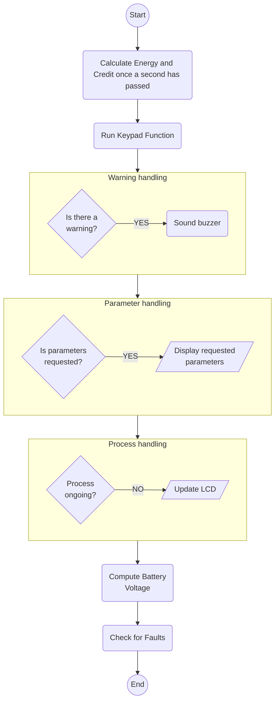

# Firmware control flow

This document describes control flow used in the OpenSmartMeter firmware.

## Timer ISR callback

```mermaid
flowchart TB
    start_flow((Start)) --> calculate(Calculate Energy and Credit once a second has passed)
    calculate --> keypad(Run Keypad Function)
    keypad --> warning

    subgraph warning[Warning handling]
        warning_check{Is there a <br> warning?} -- YES --> buzzer(Sound buzzer)
    end

    subgraph parameter[Parameter handling]
        parameters_requested{Is parameters <br> requested?} -- YES --> display_parameters[/Display requested<br>parameters/]
    end

    subgraph process[Process handling]
        ongoing_process{Process<br>ongoing?} -- NO --> update_lcd[/Update LCD/]
    end

    warning --> parameter --> process
    process  --> battery_voltage(Compute Battery<br>Voltage)
    battery_voltage --> check_faults(Check for Faults)
    check_faults --> end_flow((End))
```
