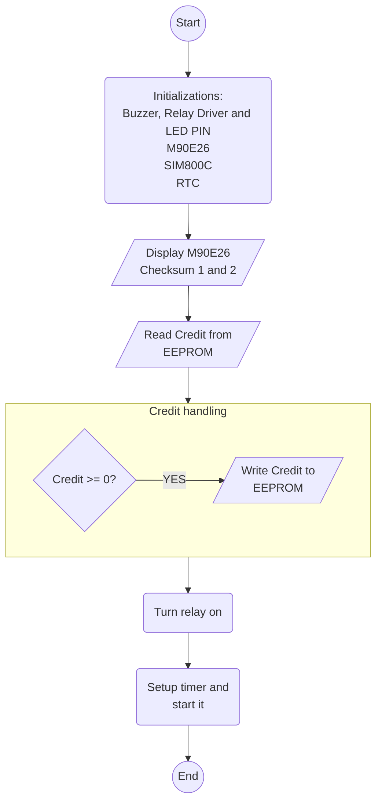
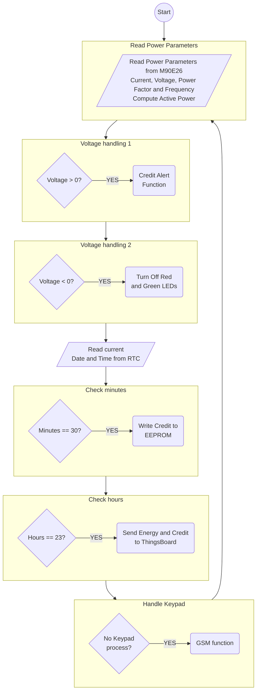
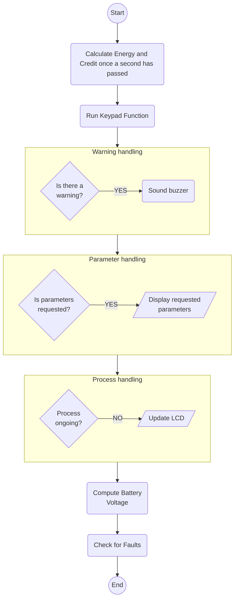

# Firmware control flow

This document describes control flow used in the OpenSmartMeter firmware.

## Setup Flowchart

```mermaid
flowchart TB
    start_flow((Start)) --> init(Initializations:<br>Buzzer, Relay Driver and LED PIN<br>M90E26<br>SIM800C<br>RTC)

    init --> display_m90e26[/Display M90E26<br>Checksum 1 and 2/]

    display_m90e26 --> read_credit[/Read Credit from<br>EEPROM/]

    subgraph credit_handling[Credit handling]
        credit_check{Credit >= 0?} -- YES --> write_credit[/Write Credit to<br>EEPROM/]
    end
    read_credit --> credit_handling

    credit_handling --> relay_on(Turn relay on)

    relay_on --> setup_timer(Setup timer and <br> start it)

    setup_timer --> end_flow((End))
```

## Loop Flowchart

```mermaid
flowchart TB
    subgraph check_voltage1[Voltage handling 1]
        voltage_above_50{Voltage > 0?} -- YES --> credit_alert(Credit Alert<br>Function)
    end
    read_power --> check_voltage1

    subgraph check_voltage2[Voltage handling 2]
        voltage_below_50{Voltage < 0?} -- YES --> turn_off_led(Turn Off Red<br>and Green LEDs)
    end
    check_voltage1 --> check_voltage2

    check_voltage2 --> read_datetime[/Read current<br>Date and Time from RTC/]

    subgraph check_minutes[Check minutes]
        minutes_30{Minutes == 30?} -- YES --> write_credit(Write Credit to<br>EEPROM)
    end
    read_datetime --> check_minutes

    subgraph check_hours[Check hours]
        hours_23{Hours == 23?} -- YES --> send_credit(Send Energy and Credit<br>to ThingsBoard)
    end
    check_minutes --> check_hours

    subgraph handle_keypad[Handle Keypad]
        check_keypad{No Keypad<br>process?} -- YES --> gsm_function(GSM function)
    end
    check_hours --> handle_keypad

    subgraph read_power[Read Power Parameters]
        read_power_id[/Read Power Parameters from M90E26<br>Current, Voltage, Power Factor and Frequency<br>Compute Active Power/]
    end
    handle_keypad --> read_power[/Read Power Parameters from M90E26<br>Current, Voltage, Power Factor and Frequency<br>Compute Active Power/]

    start_flow((Start)) --> read_power
```

## Timer ISR callback

```mermaid
flowchart TB
    start_flow((Start)) --> calculate(Calculate Energy and Credit once a second has passed)

    calculate --> keypad(Run Keypad Function)

    subgraph warning[Warning handling]
        warning_check{Is there a <br> warning?} -- YES --> buzzer(Sound buzzer)
    end
    keypad --> warning

    subgraph parameter[Parameter handling]
        parameters_requested{Is parameters <br> requested?} -- YES --> display_parameters[/Display requested<br>parameters/]
    end
    warning --> parameter


    subgraph process[Process handling]
        ongoing_process{Process<br>ongoing?} -- NO --> update_lcd[/Update LCD/]
    end
    parameter --> process

    process  --> battery_voltage(Compute Battery<br>Voltage)

    battery_voltage --> check_faults(Check for Faults)

    check_faults --> end_flow((End))
```
