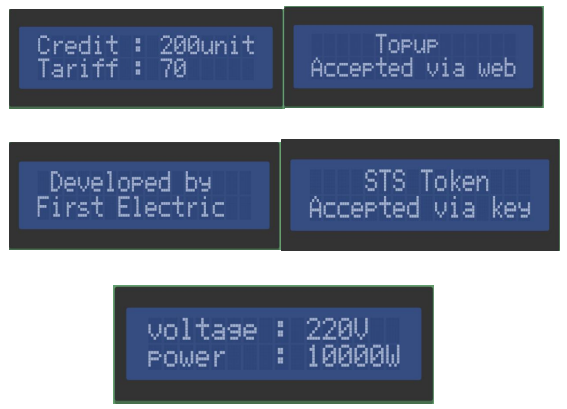

# Product and specification manual

## Introduction

This is a meter with RS232 and wireless GSM communication using Cicada GSMmodule.
It has various event alerting functions including kWh remote reading and logging, using remote management and tampering provides customers a convenient remote reading method, on the air top-up.
This meter is favored by customers and manufacturers with the features of high accuracy, wide measuring range andcompetitive cost performance.

## Tariff

Tariff is software adjustable by energy provider as desired for meter.

## Communication

Meter support RS232/2G/3G GSM, baud-rate: 115000.

## Measurement

Meter measures voltage, current, active power and voltage is displayed on the 16x2LCD, accumulative power and top-up history is logged every 24 hours ontheweb-based software.

## Mode

Meter has 2 operation modes:

1. On the air top-up.
2. STS token mode using keypad.

### Over the air top-up

Over the air top-up is done via the web-based software available, with meter to be topped up pre-registered with a unique meter-id, the rest is handled between the software and firmware to top-up the corresponding meter whose meter-id is entered automatically.

### STS operation

Enter 20-digit token via keypad available on meter, the token is generated from the website in event of network failure or malfunction.

## Technical Parameter

<!-- prettier-ignore-start -->
| DESCRIPTION | SINGLE PHASE VALUE |
| -------- | -------- |
| Accuracy | CLASS 1 |
| **Voltage**   Reference voltage   Operating voltage range |   240 V   70% - 120% Reference voltage    |
| Current | 5 (80A) |
| Frequency | 50Hz |
| **Temperature**   Operating range   Limit range for storage and transport   |                     - 250C to 700C   -400C to 1000C |
| **Power consumption**   Power consumption in voltage circuit(active)   Power consumption in voltage circuit(apparent)   Power consumption in current circuit |   2W   10VA   1VA |
| Communication Interface | DLMS / COSEMCompliance (GPRS) First Electric web API |
| Dimension | 18cm x 15cm |
| Display: | LCD 16x2 |
<!-- prettier-ignore-end -->

### Indicator

<!-- prettier-ignore-start -->
| Indicator | Description |
| -- | -- |
| Credit Indicator | Bi-color LED (red)   Green LED light on when credit is in highlevel   Red LED light on when credit is low   Red LED blinks when credit has finished |
| Alarm indicator | The indicator blinks when event occur, event such as overload, low voltage, low credit or credit exhausted. |
<!-- prettier-ignore-end -->

## Communication devices

1. RS232 communication, used for local reading/monitoring.
2. GPRS communication, used for on the air top-up, remote monitoringandcontrolling.

## Display of details on LCD

## Safety Instructions

:::danger Information for Your Own Safety

This manual does not contain all the safety measures for operation of this equipment
(module, device) because special operating conditions, local code requirements or
local regulations may necessitate further measures.

:::

## Qualified personnel

:::warning

Installation and operation, assembling of this equipment described in this manual mayonly be performed by qualified personnel. Only people who have good knowledge onpower/embedded system should assemble this equipment.

:::
