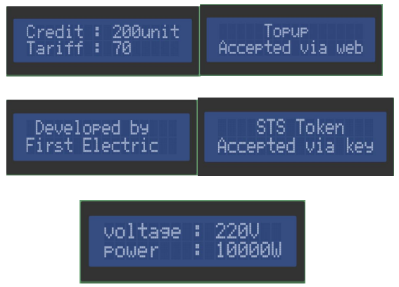

## **TITLE: PRODUCT AND SPECIFICATION MANUAL**

### **1. Introduction**
This is a meter with RS232 and wireless GSM communication using Cicada GSMmodule. It has various event alerting functions including kWh remote readingandlogging, using remote management and tampering provides customers a convenient
remote reading method, on the air top-up. This meter is favored by customers andmanufacturers with the features of high accuracy, wide measuring range andcompetitive cost performance. 

### **2. Tariff**
Tariff is software adjustable by energy provider as desired for meter. 

### **3. Communication**
Meter support RS232/2G/3G GSM, baud-rate: 115000. 

### **4. Measurement**
Meter measures voltage, current, active power and voltage is displayed on the 16x2LCD, accumulative power and top-up history is logged every 24 hours ontheweb-based software.

### **5. Mode**
Meter has 2 operation modes:

1. On the air top-up. 
2. STS token mode using keypad. 

#### **Over the air top-up**
Over the air top-up is done via the web-based software available, with meter tobetopped up pre-registered with a unique meter-id, the rest is handled betweenthesoftware and firmware to top-up the corresponding meter whose meter-id is enteredautomatically. 

#### **STS operation**
Enter 20-digit token via keypad available on meter, the token is generated fromthewebsite in event of network failure or malfunction.

### **6. Technical Parameter**

| DESCRIPTION | &nbsp; &nbsp; &nbsp;  &nbsp; &nbsp; &nbsp;   &nbsp; &nbsp; &nbsp; &nbsp;   &nbsp; &nbsp; &nbsp; SINGLE PHASE VALUE |
| -------- | -------- |
| Accuracy    | &nbsp; &nbsp; &nbsp;  &nbsp; &nbsp; &nbsp;   &nbsp; &nbsp; &nbsp; &nbsp;   &nbsp; &nbsp; &nbsp; **CLASS 1**    |
| **Voltage**     Reference voltage   Operating voltage range | &nbsp; &nbsp; &nbsp;  &nbsp; &nbsp; &nbsp;   &nbsp; &nbsp; &nbsp; &nbsp;   &nbsp; &nbsp; &nbsp;   &nbsp; &nbsp; &nbsp;  &nbsp; &nbsp; &nbsp;   &nbsp; &nbsp; &nbsp; &nbsp;   &nbsp; &nbsp; &nbsp; 240 V     &nbsp; &nbsp; &nbsp;  &nbsp; &nbsp; &nbsp;   &nbsp; &nbsp; &nbsp; &nbsp;   &nbsp; &nbsp; &nbsp; 70% - 120% Reference voltage    |
| Current    | &nbsp; &nbsp; &nbsp;  &nbsp; &nbsp; &nbsp;   &nbsp; &nbsp; &nbsp; &nbsp;   &nbsp; &nbsp; &nbsp; 5 (80A)    |
| Frequency    | &nbsp; &nbsp; &nbsp;  &nbsp; &nbsp; &nbsp;   &nbsp; &nbsp; &nbsp; &nbsp;   &nbsp; &nbsp; &nbsp; 50Hz    |
| **Temperature**   Operating range   Limit range for storage and transport   |   &nbsp; &nbsp; &nbsp;  &nbsp; &nbsp; &nbsp;   &nbsp; &nbsp; &nbsp; &nbsp;   &nbsp; &nbsp; &nbsp; - 250C to 700C   &nbsp; &nbsp; &nbsp;  &nbsp; &nbsp; &nbsp;   &nbsp; &nbsp; &nbsp; &nbsp;   &nbsp; &nbsp; &nbsp; -400C to 1000C    |
| **Power consumption**   Power consumption in voltage circuit(active)   Power consumption in voltage circuit(apparent)   Power consumption in current circuit   |   &nbsp; &nbsp; &nbsp;  &nbsp; &nbsp; &nbsp;   &nbsp; &nbsp; &nbsp; &nbsp;   &nbsp; &nbsp; &nbsp; 2W   &nbsp; &nbsp; &nbsp;  &nbsp; &nbsp; &nbsp;   &nbsp; &nbsp; &nbsp; &nbsp;   &nbsp; &nbsp; &nbsp; 10VA   &nbsp; &nbsp; &nbsp;  &nbsp; &nbsp; &nbsp;   &nbsp; &nbsp; &nbsp; &nbsp;   &nbsp; &nbsp; &nbsp; 1VA    |
| Communication Interface    | &nbsp; &nbsp; &nbsp;  &nbsp; &nbsp; &nbsp;   &nbsp; &nbsp; &nbsp; &nbsp;   &nbsp; &nbsp; &nbsp; DLMS / COSEMCompliance   &nbsp; &nbsp; &nbsp;  &nbsp; &nbsp; &nbsp;   &nbsp; &nbsp; &nbsp; &nbsp;   &nbsp; &nbsp; &nbsp; (GPRS)First Electric web API    |
| Dimension    | &nbsp; &nbsp; &nbsp;  &nbsp; &nbsp; &nbsp;   &nbsp; &nbsp; &nbsp; &nbsp;   &nbsp; &nbsp; &nbsp; 18cm x 15cm    |
| Display:    | &nbsp; &nbsp; &nbsp;  &nbsp; &nbsp; &nbsp;   &nbsp; &nbsp; &nbsp; &nbsp;   &nbsp; &nbsp; &nbsp; LCD 16x2   |

**Indicator**

|  |  |  |
|  | |  |
| 1    | Credit Indicator    | Bi-color LED (red)   Green LED light on when credit is in highlevel   Red LED light on when credit is low   Red LED blinks when credit has finished   |
| 2    | Alarm indicator    | The indicator blinks when event occur,   event suchas overload, low voltage, lowcredit or creditexhausted.    |

### **7. communication**

1. RS232 communication, used for local reading/monitoring. 
2. GPRS communication, used for on the air top-up, remote monitoringandcontrolling.

### **8. Display of details on LCD**

### **9. Safety Instructions**
**Information for Your Own Safety**  
This manual does not contain all the safety measures for operation of this equipment
(module, device) because special operating conditions, local code requirements or
local regulations may necessitate further measures. 

### **10. Qualified personnel**
Installation and operation, assembling of this equipment described in this manual mayonly be performed by qualified personnel. Only people who have good knowledge onpower/embedded system should assemble this equipment.
