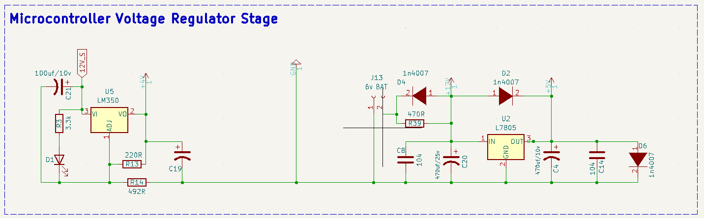
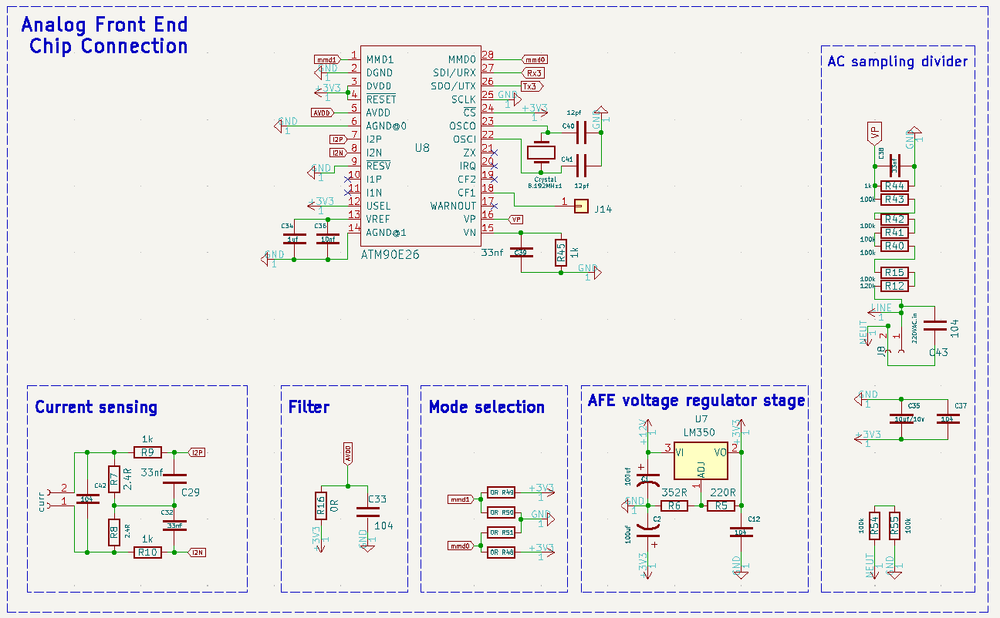
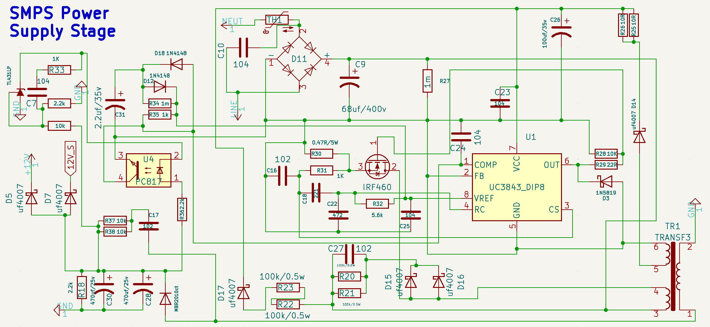
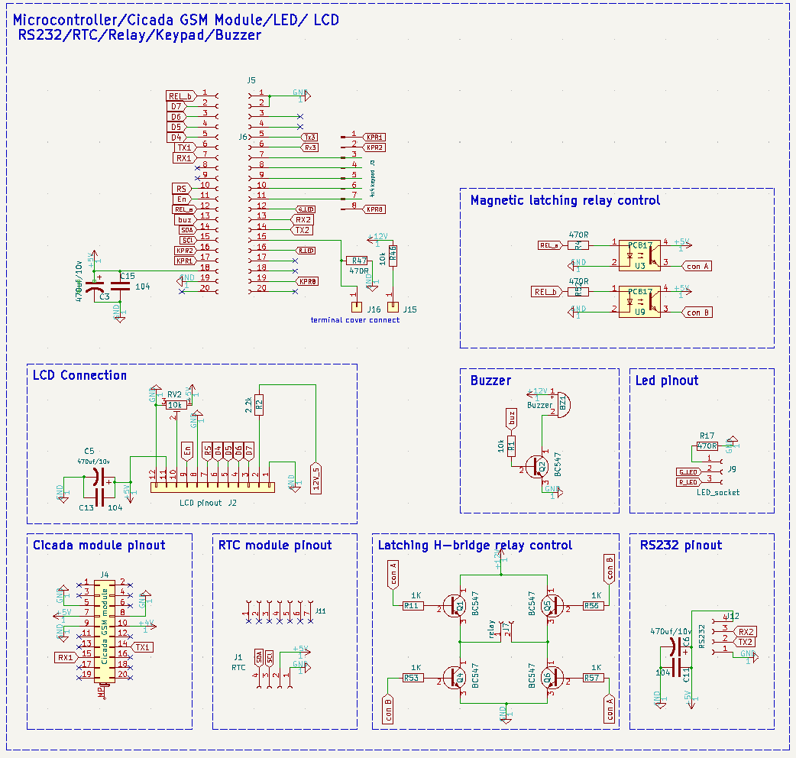

# Schematic Overview

## Microcontroller voltage regulation stage

The voltage regulation stage contains the `7805IC` to regulate the voltage from the SMPS power supply to 5V as this is the safe voltage level to power the microcontroller, also this stage contains the `LM350IC` to regulate the SMPS power sully to 4V to power the GSM module.

## Analog front end chip connection

The analog front end chip (AFE) is a metering IC suitable for a class1 and class2 accuracy meter and fit for use according to the relevant metering standard as specified by IEC.
It is used in this design to measure power, voltage, current, power factor etc..

## SMPS power supply stage

The SMPS stage converts the AC input voltage supplied into the meter to 12V DC to power the internal electronics circuit.

## Microcontroller/Cicada GSM Module/LED/ LCD\n RS232/RTC/Relay/Keypad/Buzzer

The master of this stage is the microcontroller(STM32f103ccu8) popularly known as bluepill, it fethes outputted meter values from the AFE chip via the USART communication interface, it also communicate with the webpage via the Cicada GSM module and sends neccesary meter parameters to the RS232 port, this stage also interface with other hardware pheripherials such as keypad, buzzer, magnetic latching relay, LED, LCD.

